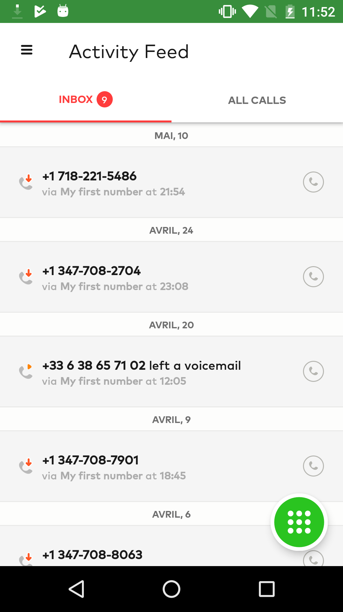
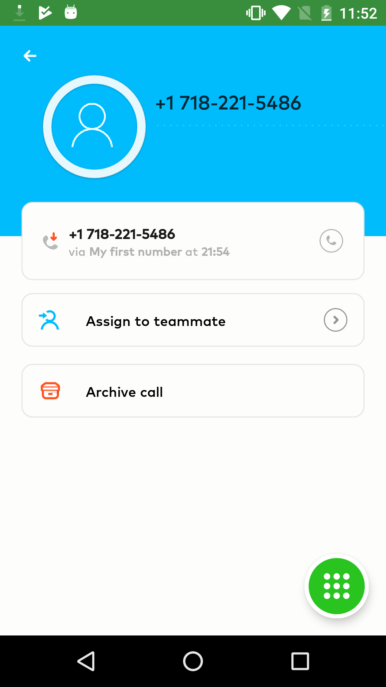

# [aircall.io](https://aircall.io) - Android technical test

This test is part of our hiring process at Aircall for [Android Software Engineer positions](https://aircall.io/jobs). You'll have to do it on site within 2h30.

**Feel free to apply! Drop us a line with your LinkedIn/GitHub/Twitter/AnySocialProfileWhereYouAreActive at jobs@aircall.io**


## Summary

The goal of this test is to make you code a small Android app from scratch. You are free to use the libraries you need and the architecture you find the most appropriate.

Your app must implement the following scenario:

1. Main screen will display a list of calls (Activity Feed)
2. Tapping on a call will navigate to a call detail
3. End user should be able to navigate in app without a working Internet connection (offline mode)
4. End user should be able to archive a call from the Activity Detail page. Once archived, the call will no longer be displayed on the Activity Feed


Try to finish as many steps as you can in 2h30 - it's ok if you don't complete all the tasks :)

Don't spend too much time on designing your app, we'll only look at your code architecture.

Activity feed                       |  Call detail
:-------------------------:|:-------------------------:
  |  


## API documentation

### Routes

Here is the API address: https://aircall-job.herokuapp.com.

As you can see, it's hosted on a free Heroku server, which means that the first time you will fetch the API, it will take few seconds to answer.

- **GET** - https://aircall-job.herokuapp.com/activities: get calls to display in the Activity Feed
- **GET** - https://aircall-job.herokuapp.com/activities/:id: retrieve a specific call details
- **POST** - https://aircall-job.herokuapp.com/activities/:id: update a call. The only field updatable is `is_archived (bool)`. You'll need to send a JSON in the request body:
```
{
  is_archived: true
}
```
- **GET** - https://aircall-job.herokuapp.com/reset: Reset all calls to initial state (usefull if you archived all calls).


### Call object

- **id** - unique ID of call
- **created_at** - creation date
- **direction** - `inbound` or `outbound` call
- **from** - caller's number
- **to** - callee's number
- **via** - Aircall number used for the call
- **duration** - duration of a call (in seconds)
- **is_archived** - call is archived or not
- **call_type** - can be a `missed`, `answered` or `voicemail` call.


## Submission

At the end of the allocated time, submit a pull request on this repository and ping you point of contact at Aircall.

Don't forget to include a **README** file with the following:
- Write a brief outline of the architecture of your app
- Explain your choice of libraries
- What was the most difficult part of the challenge?
- Estimate your percentage of completion and how much time you would need to finish
